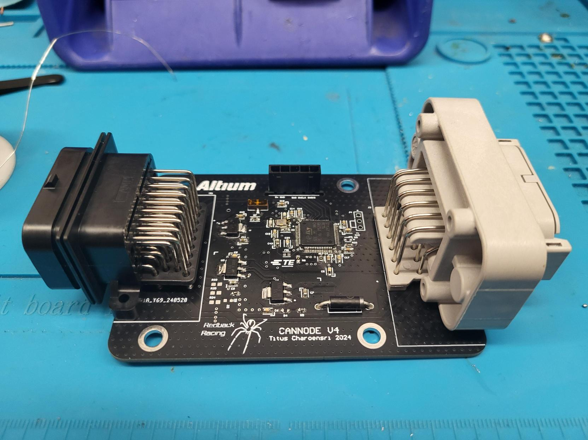
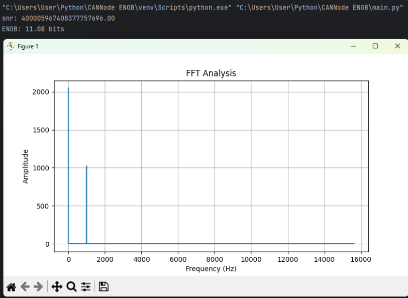
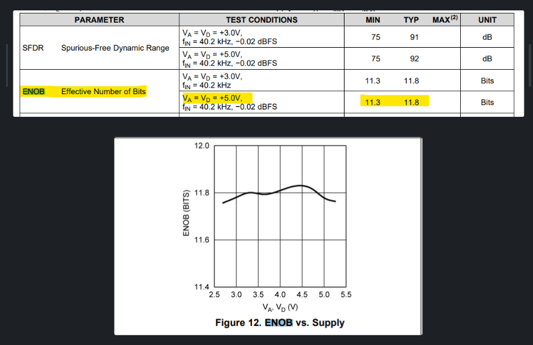
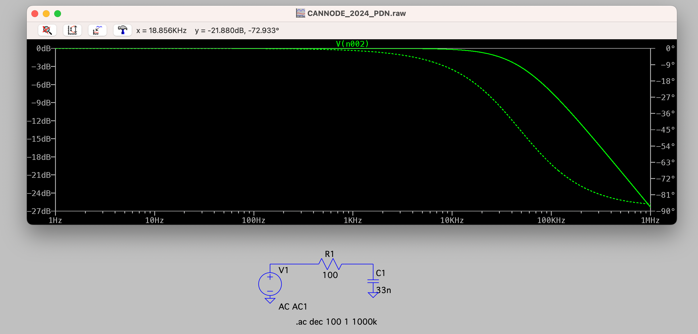
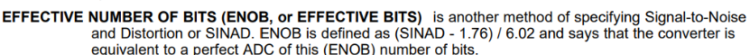

# RedBack Racing SensorHub PCB ADC Validation using ENOB

The CANNode PCB gathers analogue sensor data to an 12-bit ADC chip, which then communicates via SPI to an STM32F446RET6 chip. The data is lightly processed and packaged into a CAN2.0-A packet and sent to the ECU via a full speed CANBUS. 

## Introduction

This Repository contains the algorithm i used to perfrom Fourier Analysis on raw ADC data values that were parsed into a txt file. This code will output a ENOB value which is calculated using SNR (Signal to noise Ratio). It is better to use SINAD as this also accounts for harmonic distorion, however this is something i will improve on the future.

ADC Chip: https://octopart.com/adc128s102cimt%2Fnopb-texas+instruments-24823012?r=sp

## Features
- Outputs ENOB VALUE
- Displays FFT plot

## Testing Process
ENOB stands for Effective Number of Bits. It is a measure of the actual performance of an Analog-to-Digital Converter (ADC) and is used to quantify how many bits of the ADC are effectively being used to represent the analog input signal. 

There are a couple of ways to calculate ENOB, we used to use SNR (signal to noise ratio), SINAD (Signal to noise and distortion ratio) or THD (Total harmonic distortion). Once we obtain a ENOB value we can compare  with the manufacturer's specifications for the ADC resolution.

### Setup and Preparation

Analog Signal Source: I set up a signal generator to produce a 1 kHz sine wave with an amplitude of 5V peak-to-peak, 2.5v DC offset.

### Capture ADC Data

Sampling: Use the STM32 MCU to capture a large number of samples from the ADC. Ensure that the sampling rate is appropriate for the input signal frequency. (e.g. >10 times the input signal frequency)

Sampling rate calculations:

Frame Format: Motorola 

Data size: 8 bits 

First bit: MSB First 

Clock polarity: HIGH 

Clock phase: 1 edge 

CRC calculation: disabled

Time per SPI clock cycle: 2 μs 

Each ADC sample would require two SPI transactions (16 clock cycles).

Time per conversion: 32 μs 

Sampling rate: 1/Time per Conversion =  31.25 kSPS

Capture samples of the ADC output and store them in an array. (Parse values into a txt file)

Note: Does not account for ADC acquisition or sample & hold time, couldn't find in the datasheet.

### Perform FFT Analysis

FFT Computation: Use an FFT algorithm to analyze the frequency spectrum of the captured ADC data. 

I have used Python with NumPy to perform the FFT.
### Compare ENOB Value to ADC Datasheet
Program calculates ENOB. Compare the calculated ENOB with the specified ENOB for ADC128S102CIMT/NOPB , 12-bit ADC.

FINAL ENOB: 11.08

FFT Analysis shows a peak at 1Khz corresponding to fundamental frequency of 1khz input sine wave, the peak at 0hz is due to the 2.5v DC offset. 

Datasheet specifications of ADC128S102CIMT/NOPB:

### Conclusion

The calculated ENOB value was 11.08, which is slightly on the low side since the minimum value should be somewhere in the “11.x” range, especially with the ENOB vs. Supply graph showing it should be closer to 11.8. Furthermore, LTspice simulation of the ADC input filtering clearly shows 0db attenuation at 1Khz, so this lower ENOB could result from a variety of other reasons.

I think this is somewhat due to my Sample rate calculations. The datasheet specifies a sample rate of 500 kSPS - 1MSPS sample rate, however the datasheet does not specify how to calculate the exact sample rate the ADC is running at. Thus I have ignored their sample rate range and calculated it myself using my understanding of SPI and how it works with this chip, which may be flawed and resulted in a different value. 

This lower value is more likely to come from the filtering input stage of the ADC input, non-linearities in solder joints or interconnects, and the baud rate being 500Khz which is quite slow resulting in larger gaps in sample data. I have ignored Latency between CANNode PCB and the Nucleoboard reciever on the CANbus because there were only 2 nodes running at 1Mhz so all data would have been transmitted and logged in the com-port.

### Notes/comments

SNR value scale:

A weird quirk with my code is that, it would output sensible SNR values only when i multiplied by “1e20”. This might be due to my lack of understanding of the FFT functions in “numpy” but it is something that i haven’t figured out why it works that way. 

SNR vs SINAD:

The datasheet of the ADC actually specifies to calculate ENOB using SINAD instead of SNR:

Which is a more accurate value as it also accounts for the power of harmonic distortions. Where in terms of FFT, to find the Distortion Power, you would sum the powers in the relevant FFT bins of each harmonic.

HOWEVER for some reason SINSAD values would be behave wildly when I did this (I probably goofed) and so I settled with using SNR instead of SINAD, using only signal to noise ratio and ignoring distortion.
